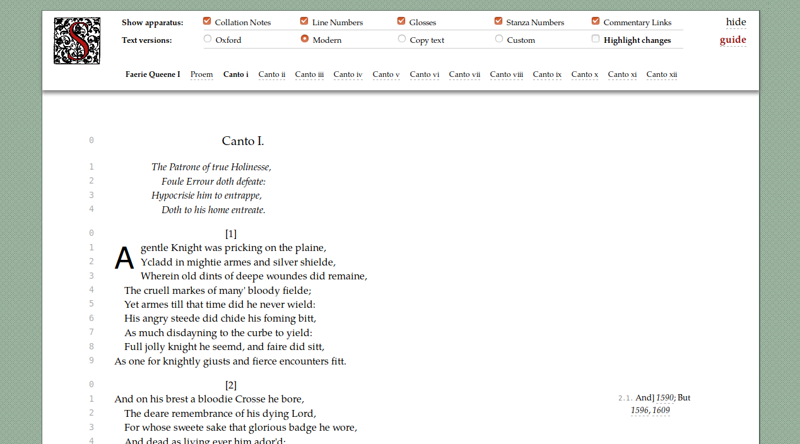
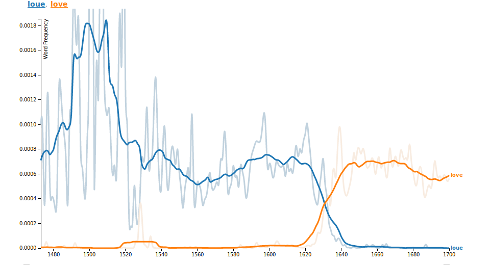
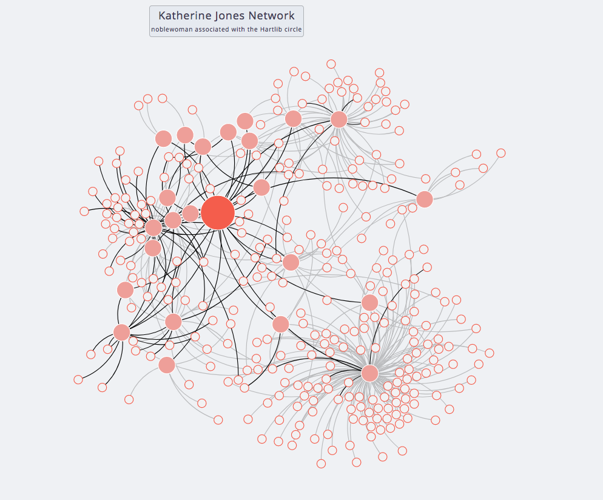
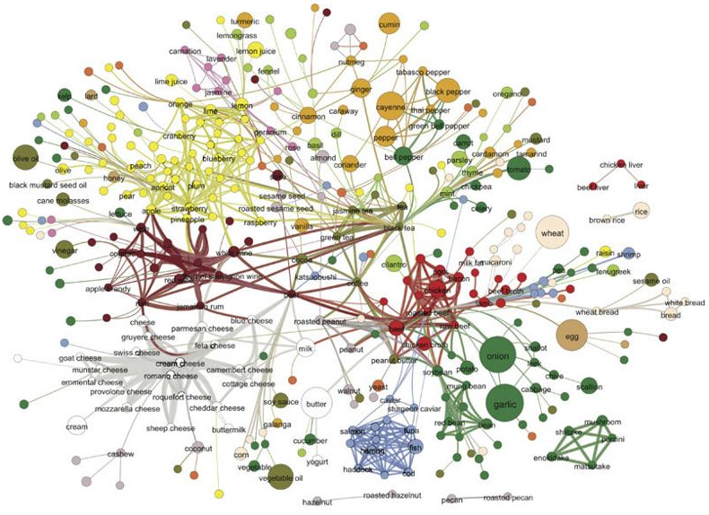
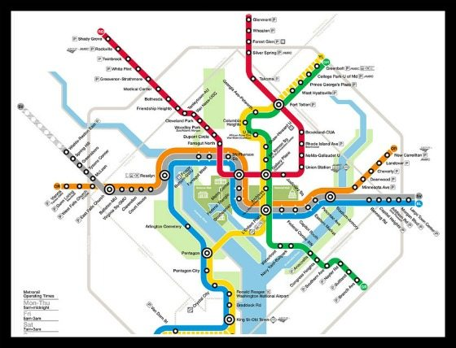
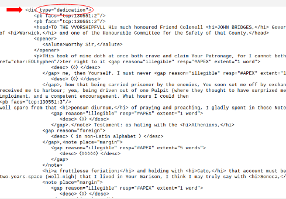
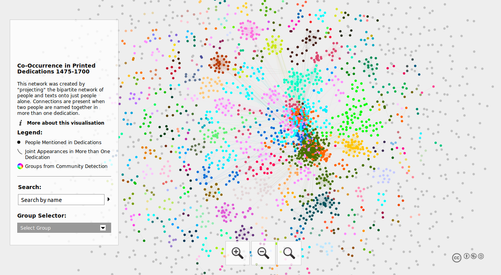
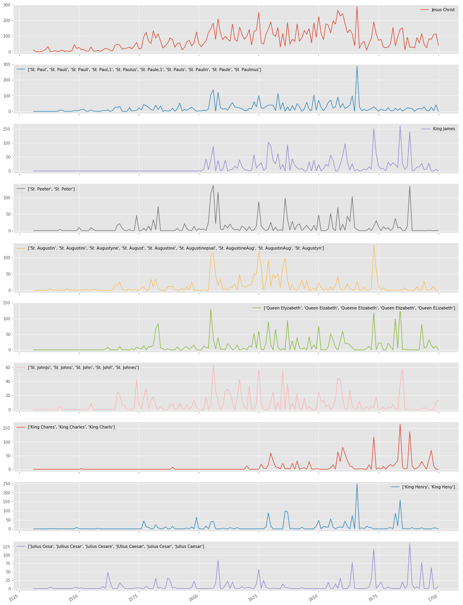
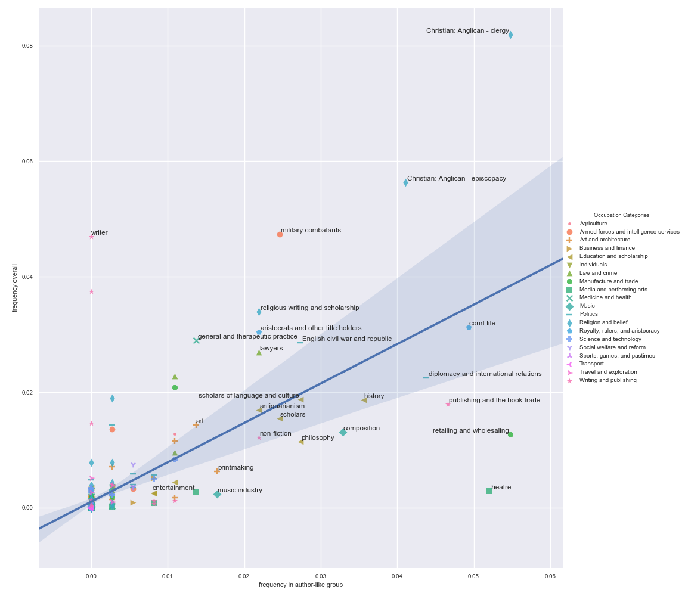

 <section data-menu-title="Title:  Thinking with Networks"></section>
 
 
## Thinking with Networks
### in the Interdisciplinary Classroom
 
 <small>[John R. Ladd](http://jrladd.com/) / [@johnrladd](https://twitter.com/johnrladd) </small>

 <small>21 February 2019</small>

<small>To navigate, press the arrows <i class="em em-arrow_right"></i> <i class="em em-arrow_down"></i> or hit the space bar</small>

---

### Why Digital Humanities?

---

### What is a network?

- a data structure
- a visualization paradigm
- a way of representing the world

---

# Research

--

--

--

--

--

--

---

# Teaching

--

### Humanities Network Analysis

Learning Goals (In This Class You Will...):

<small>learn core network concepts (e.g. centrality, projection, path length)</small>

<small>learn to build a network dataset from historical sources</small>

<small>contribute to ongoing humanities network projects</small>

<small>learn the [basics of investigating networks with Python (NetworkX)](https://programminghistorian.org/en/lessons/exploring-and-analyzing-network-data-with-python)</small>

<small>think critically about the impact networks have on the past and present</small>

--

### Network basics

- Nodes and edges

- Directed vs. Undirected

- Unipartite vs. Bipartite

--

### The Three Key Questions

<small>(To Ask When Creating a Network Dataset)</small>

- What do I want to learn from this network?

- How should I define a node? an edge?

- Are my edges directed or undirected?

<small>[Go to Pepys](https://www.pepysdiary.com/diary/1667/02/21/)</small>

---

### Thank you!
