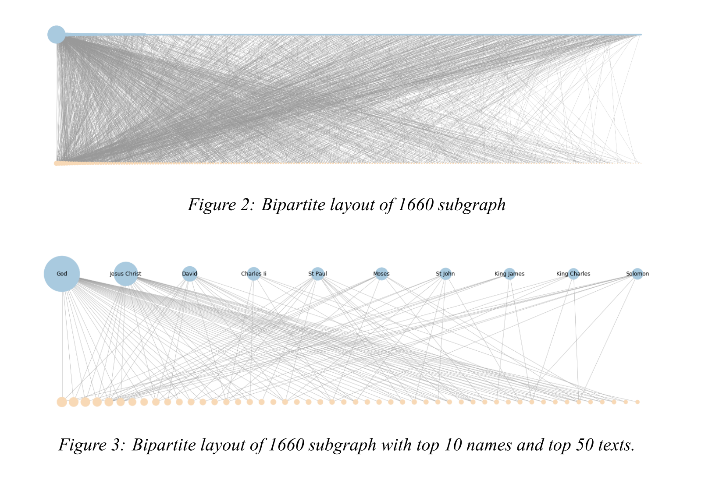

<main class="site">

<section class="intro">
  

  
  
John R. Ladd

  
Assistant Professor, Computing and Information Studies

  
<a href="https://www.washjeff.edu/person/john-ladd/" target="_blank">Washington & Jefferson College</a>

  
<a href="https://github.com/jrladd" target="_blank">GitHub</a>. <a href="https://orcid.org/0000-0002-5440-062X" target="_blank">ORCiD</a>. <a href="https://zotero.org/johnrobertladd" target="_blank">Zotero</a>.

  

  

  

  I'm an Assistant Professor in Computing and Information Studies at <a href="https://www.washjeff.edu/programs/computing-and-information-studies-cis/" target="_blank">Washington & Jefferson College</a>, where I teach and research on the use of data across a wide variety of domains, especially in cultural and humanities contexts. Previously, I was a Postdoctoral Fellow in Digital Humanities at <a href="https://humanities.northwestern.edu/about/people/postdoctoral-fellows-here-program/index.html">Northwestern University</a>, where I worked on <a href="https://earlyprint.org" target="_blank">EarlyPrint</a>. Before that, I received my PhD in English from <a href="https://english.wustl.edu/">Washington University in St. Louis</a>.
  

  

  I use humanities approaches to data and network analysis to think about the long, interwoven histories of media and technology, especially in early modern literature. My current book project, <em>Network Poetics</em>, traces the history of early modern literary collaboration using social network analysis and argues that shifts in the networks of print production allowed for the emergence of new literary forms. I also work on the history of secret codes and mathematical forms in seventeenth-century literature.
  

  

</section>
<section class="recent">
  <h2 >Some Recent Work</h2>
  <article class="recent-article">
    <a href="https://culturalanalytics.org/article/21993-imaginative-networks-tracing-connec-tions-among-early-modern-book-dedi-cations" target="_blank">
        

          
        

        

          <h3 >Imaginative Networks: Tracing Connections Among Early Modern Book Dedications</h3>
          
An article for the Journal of Cultural Analytics that uses bibliographic network analysis to help understand the history of early modern print culture.

        

    </a>
  </article>
  <article class="recent-article">
    <a href="https://earlyprint.org/jupyterbook" target="_blank">
        

          
        

        

          <h3 >EarlyPrint + Python</h3>
          
A textbook for early modern text analysis in the programming language Python, built as an interactive Jupyter Book. Topics covered include TF-IDF, word vectors, and supervised text classification.

        

    </a>
  </article>
  <article class="recent-article">
    <a href="https://networknavigator.jrladd.com" target="_blank">
        

          
        

        

          <h3 >Network Navigator</h3>
          

	  A browser tool for network analysis, with special emphasis on quantitative metrics and less common visualization types. Redesigned in 2021 with Zoe LeBlanc.
          

        

    </a>
  </article>
  <article class="recent-article">
    <a href="https://observablehq.com/@jrladd/linked-art-1" target="_blank">
        

          
        

        

          <h3 >Exploring Linked Art</h3>
          

	  A series of tutorials, made in partnership with the Getty Museum, showing how to work with Linked Art, a linked open data model for cultural heritage objects. The Observable JavaScript tutorials demonstrate how to analyze artworks in Getty's Online Collections.
          

        

    </a>
  </article>
  <article class="recent-article">
    <a href="https://earlyprint.org/bibliographia" target="_blank">
        

          
        

        

          <h3 >Bibliographia</h3>
          
An interactive plot of 50,000+ printed books from the sixteenth and seventeenth centuries, using LDA topic models and LargeVis to cluster similar texts. Made in D3.js and Canvas for the EarlyPrint project.

        

    </a>
  </article>
</section>

</main>
