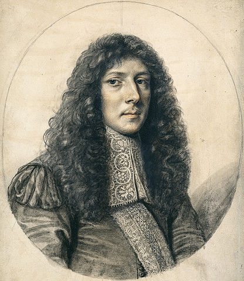
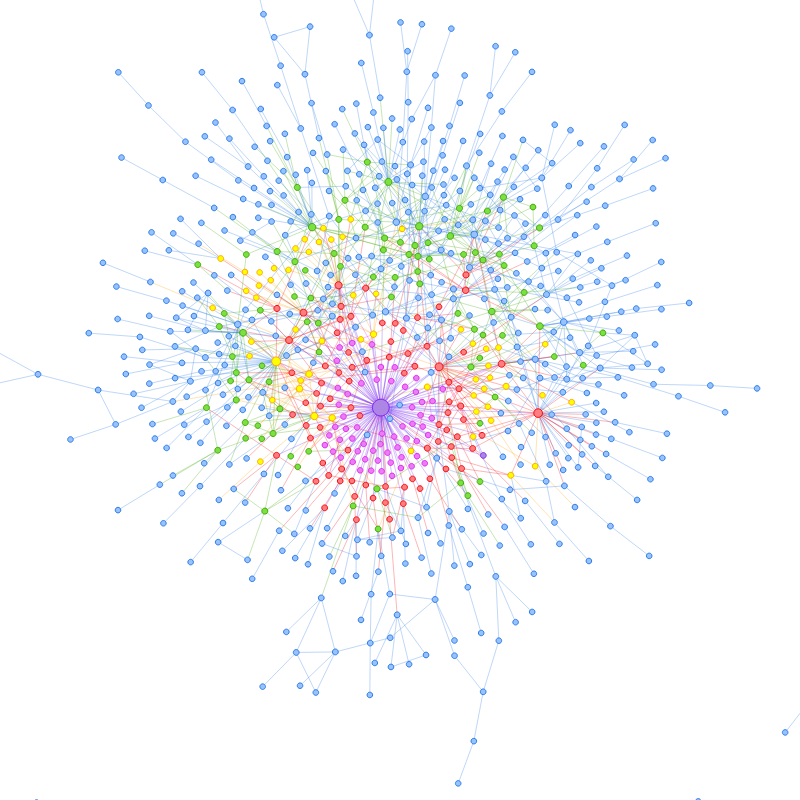
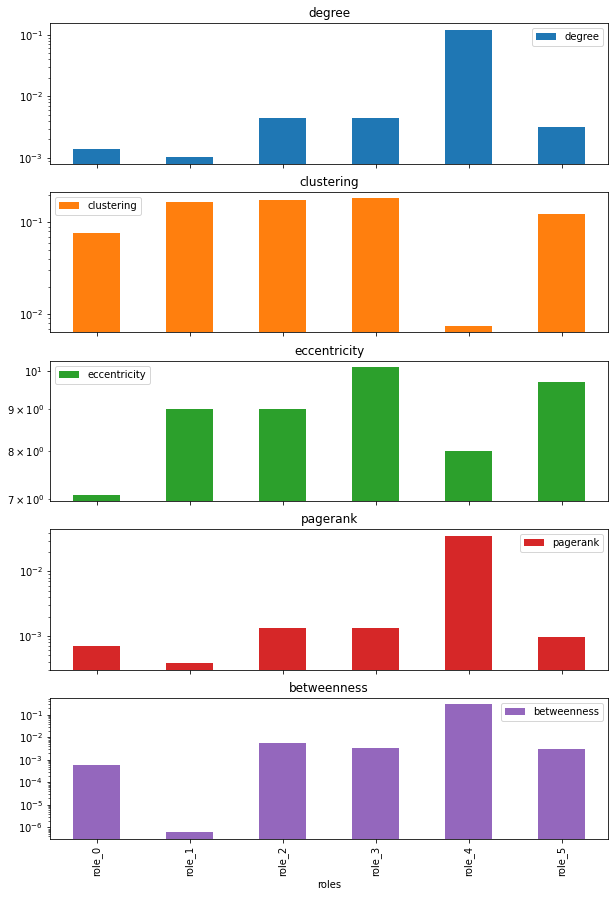
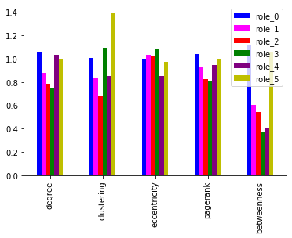

## Comparing Networks of Biography
 
*Six Degrees of Francis Bacon* and John Aubrey's *Brief Lives*

<small>John R. Ladd | @johnrladd | jrladd.com/slides/aubrey</small>

<small>(use arrow keys or spacebar to navigate)</small>

---

  
"We may be able to hear, through him, the 17th century talking to and about itself."

<small>Kate Bennett, ed. *Brief Lives* (2016)</small>

## Aubrey's Accounts

- John Denham was "rooked by gamesters"
- In young adulthood, Edmund Waller "grew (upon I know not what occasion) mad"
- Samuel Butler's "painted well: and made it (sometime) his profession"

## Denham & Wither

"John Denham went to the King and desired his Majestie not to hang him [Wither], for that whilest George Withers lived, he should not be the worst Poet in England."  (Aubrey 349)

## Six Degrees of Francis Bacon

## Communities vs. Roles

Community Detection

Role Detection

## Community Detection

## Role Detection

---

{width="40%"}

## NodeSense

## NeighborSense

---

## Who's in Role 3?

- Lucy Hutchinson
- Margaret Cavendish
- Aphra Behn
- John Milton

- John Locke
- Robert Hooke
- Isaac Newton
- Katherine Jones
- and John Aubrey

---

