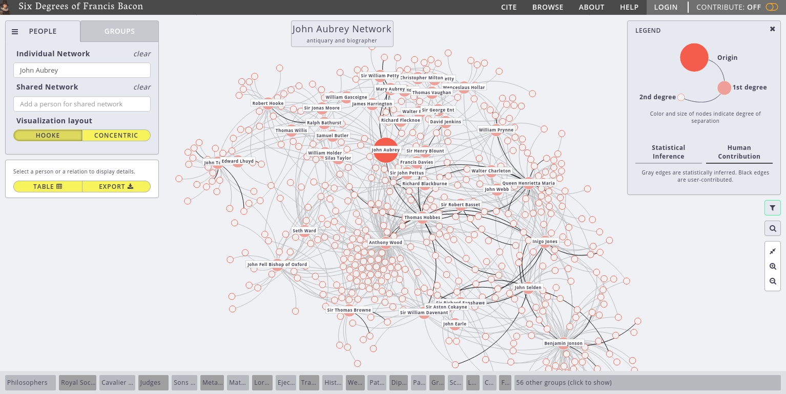
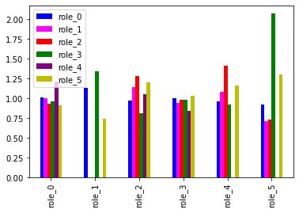

% Networked Authorships and Aubrey's Brief Lives
% John R. Ladd | @johnrladd | jrladd.com/slides/aubrey
% (use arrow keys or spacebar to navigate)

  
"We may be able to hear, through him, the 17th century talking to and about itself."

<small>Kate Bennett, ed. *Brief Lives* (2016)</small>

## Denham & Wither

"John Denham went to the King and desired his Majestie not to hang him [Wither], for that whilest George Withers lived, he should not be the worst Poet in England."  (Aubrey 349)

## Six Degrees of Francis Bacon

## Communities vs. Roles

Community Detection

Role Detection

## Sense-making

NodeSense

NeighborSense

---

## Who's in Role 3?

- Lucy Hutchinson
- Margaret Cavendish
- Aphra Behn
- John Milton

- John Locke
- Robert Hooke
- Isaac Newton
- Katherine Jones
- and John Aubrey

---

