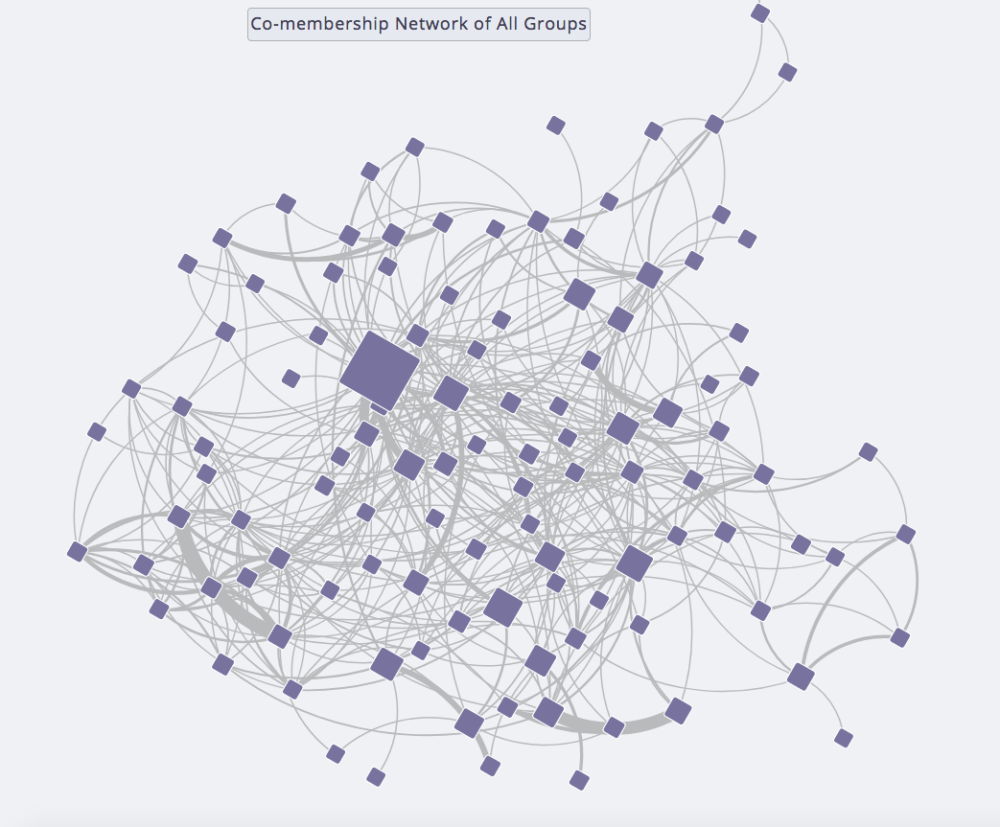
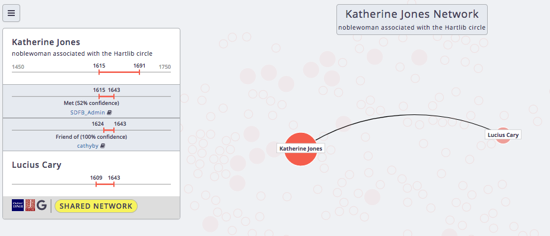
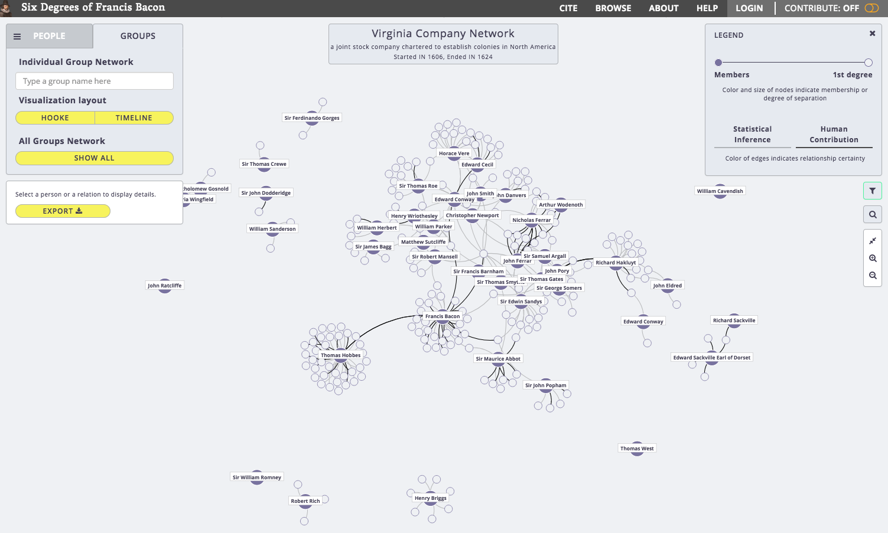
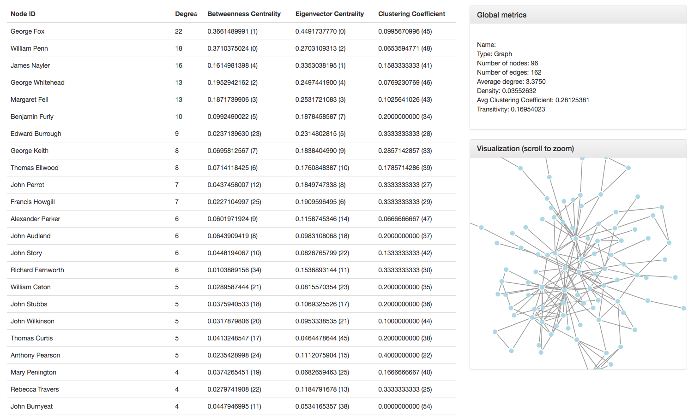
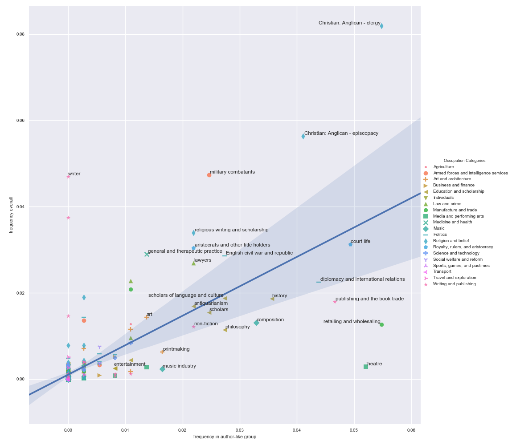

 <section data-menu-title="Title:  James Baldwin, #BlackLivesMatter, and Networks of Textual Recirculation"></section>
 
 
## Six Degrees of Francis Bacon
#### <i class="em em-thinking_face"></i> <i class="em em-bacon"></i> <i class="em em-computer"></i>
[sixdegreesoffrancisbacon.com](http://sixdegreesoffrancisbacon.com)
 
 
 
 <small>[JR Ladd](http://jrladd.com/) / [@johnrladd](https://twitter.com/johnrladd) </small>

<small>To navigate, press the arrows <i class="em em-arrow_right"></i> <i class="em em-arrow_down"></i> or hit the space bar</small>

---

### Networks can describe any system of relationships

---

### Networks have no single visualization

---

### Edges can embed a lot of information

---

### Groups vs. Networks

--

--

--

---

### Network Metrics

---

### Thank you!

<i class="em em-bacon"></i> <i class="em em-bacon"></i> <i class="em em-bacon"></i>
