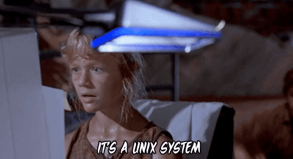

 <section data-menu-title="Title:  Text as Interface"></section>
<br>
<br>
## Text as Interface:
### Analyzing Data on the Command Line

[jrladd.com/commandline](https://jrladd.com/commandline)
<br>
<br>
 <small>[John R Ladd](https://jrladd.com/) / [@johnrladd](https://twitter.com/johnrladd) </small>

<small>To navigate, press the arrows <i class="em em-arrow_right"></i> <i class="em em-arrow_down"></i> or hit the space bar</small>

---

### What is Unix? What is the Command Line?



<small>**Unix**: A family of operating systems that includes MacOS and Linux  
**Command Line (shell)**: "a program that takes keyboard commands and passes them to the operating system to carry out" ([Shotts](https://nostarch.com/tlcl2))  
**GUI (graphical user interface)**: the "normal", visual interface of windows and applications  
**Synonyms/Acronyms for "command line"**: CLI, shell, sh, bash, terminal
</small>


---

### What can you do with CLI?


- navigate your computer
- manage files (create, delete, read, edit)
- run programs
- use programming languages
- access the internet and download files
- combine commands/applications
- count, aggregate, and analyze... anything!

---

### How to Use this Tutorial

<small>
From here forward, you'll find lists of commands and their functions, followed by exercises with those commands.

You'll run these exercises inside the Terminal application on your Mac or Linux operating system. ([Click here](https://programminghistorian.org/en/lessons/intro-to-bash#windows-only-installing-git-bash) for Windows-based instructions.) Type each line as it appears in order, and then hit `<ENTER>` to run that line.

If you see, `<TAB>` in a command, hit the tab key on your keyboard (don't type the word TAB).

And if you encounter any problems or have a question, feel free to [contact me](https://jrladd.com/).</small>

---

### The Basics

- `pwd`: Print Working Directory, see where you are currently

<!-- .element: class="fragment" -->
- `cd <directory/path>`: Change Directory; move to any directory/folder

<!-- .element: class="fragment" -->
- ls: list contents of current directory (or any directory)

<!-- .element: class="fragment" -->
- `mkdir <directory name>`: Make a new directory/folder

<!-- .element: class="fragment" -->
- `<TAB>`: autocomplete any filename or directory

<!-- .element: class="fragment" -->
- `man <command>`: see manual for any command

<!-- .element: class="fragment" -->

---

# But First, Directory Structure

--

### There's No Place Like Home

When you type `pwd` and hit enter you'll see your "home" directory. In my case it's:

```
/home/jrladd
```

In yours it might be "`/Users/yourUsername`" or something else.

This is also written as "`~`"

Typing "`cd ~`" will always bring you home!

--

### Navigating the Filesystem

```
pwd
```
<!-- .element: class="fragment" -->

```
ls
```
<!-- .element: class="fragment" -->

```
mkdir test_dir
ls
cd test_dir
```
<!-- .element: class="fragment" -->

```
cd ..
```
<!-- .element: class="fragment" -->

```
ls De<TAB>
```
<!-- .element: class="fragment" -->

```
man ls
```
<!-- .element: class="fragment" -->

```
ls -la De<TAB>
```
<!-- .element: class="fragment" -->

---

### Manipulating Files

<small>`touch <filename>`: create empty file/change its timestamp</small>
<!-- .element: class="fragment" -->
<small>`echo "<any text>"`: repeat any text to standard output</small>
<!-- .element: class="fragment" -->
<small>`<command> > <filename>`: put any output into file</small>
<!-- .element: class="fragment" -->
<small>`<command> >> <filename>`: put any output at end of file</small>
<!-- .element: class="fragment" -->
<small>`<command> < <filename>`: put contents of file into command</small>
<!-- .element: class="fragment" -->
<small>`*`: any bit of text (So `*.txt` would be all `.txt` files)</small>
<!-- .element: class="fragment" -->
<small>`cat <filename>`: repeat contents of file to standard output</small>
<!-- .element: class="fragment" -->
<small>`less <filename>`: see file in basic file viewer</small>
<!-- .element: class="fragment" -->
<small>`cp <filename> <destination/new filename>`: Copy a file</small>
<!-- .element: class="fragment" -->
<small>`mv <filename> <destination/new filename>`: Move or rename a file</small>
<!-- .element: class="fragment" -->
<small>`rm <filename>`: Remove a file or directory (Be careful!)</small>
<!-- .element: class="fragment" -->

--

### Manipulating Files (cont.)

```
cd test_dir
ls
```
<!-- .element: class="fragment" -->

```
touch test_file.txt
ls
```
<!-- .element: class="fragment" -->

```
echo "Knock, Knock"
echo "Knock, Knock" > test_file.txt
cat test_file.txt
```
<!-- .element: class="fragment" -->

```
echo "Who's there?" >> test_file.txt
cat test_file.txt
```
<!-- .element: class="fragment" -->

```
less te<TAB>
q
```
<!-- .element: class="fragment" -->

--

### Manipulating Files (cont.)

```
cp test_file.txt duplicate_file.txt
cat duplicate_file.txt
ls
cat *.txt
```
<!-- .element: class="fragment" -->

```
mv test_file.txt renamed_file.txt
cat renamed_file.txt
ls
```
<!-- .element: class="fragment" -->

```
rm duplicate_file.txt
```
<!-- .element: class="fragment" -->

---

### Analyzing Files

<small>`wget <URL>`: download a file from the internet</small>
<!-- .element: class="fragment" -->
<small>`unzip <zipfile>`: extract the contents of a .zip file</small>
<!-- .element: class="fragment" -->
<small>`wc <filename>`: counts words (`-w`), lines (`-l`), and characters (`-c`)</small>
<!-- .element: class="fragment" -->
<small>`grep <search term> <filename>`: search within a file or group of files, use `-c` to count occurrences</small>
<!-- .element: class="fragment" -->
<small>`tr '<original_text>' '<replacement_text>'`: transform all occurrences of some text with some other text</small>
<!-- .element: class="fragment" -->
<small>`sort`: put anything into alphabetical/numerical order</small>
<!-- .element: class="fragment" -->
<small>`uniq`: reduce a list to only unique items, use `-c` to count them</small>
<!-- .element: class="fragment" -->
<small>`ptx`: create a "permuted index" for keyword searching</small>
<!-- .element: class="fragment" -->
**<small>`|`: "pipe" is the Most Useful Operator, move the output of one command to the output of any other</small>**
<!-- .element: class="fragment" -->

--

### Analyzing Files (cont.)

```
wget jrladd.com/inauguralspeeches.zip
ls
```
<!-- .element: class="fragment" -->

```
unzip ina<TAB>
ls
cd inauguralspeeches
ls
```
<!-- .element: class="fragment" -->


```
"How many words are in one file? in all files?"
wc -w 1_washington_1789.txt
wc -w *.txt
```
<!-- .element: class="fragment" -->

```
"How many files are in the directory?"
ls
ls | wc -l
```
<!-- .element: class="fragment" -->

--

### Analyzing Files (cont.)

```
"Find one word in a file"
grep -i justice 3_ad<TAB>
grep -oi justice 3_ad<TAB>
grep -ci justice 3_ad<TAB>
grep -oi justice 3_ad<TAB> | wc -l
```
<!-- .element: class="fragment" -->

```
"Find one word in all files"
grep -oi justice *.txt
grep -oi justice *.txt | wc -l
```
<!-- .element: class="fragment" -->

```
"Count all words in entire corpus"
cat *.txt | tr ' ' '\n' | sort | uniq -c | sort -n
```
<!-- .element: class="fragment" -->

```
"Keyword in Context (KWIC) Search"
ptx -f -w 50 *.txt
ptx -f -w 50 *.txt | grep -i justice
ptx -f -w 50 *.txt | grep -i  "[[:alpha:]]   justice"
```
<!-- .element: class="fragment" -->

---

### Resources

<small>[Explain Shell](https://explainshell.com/): Full explanation of any command

[Command Line Cheatsheet](https://www.git-tower.com/blog/command-line-cheat-sheet/): Comprehensive list of basic commands

#### Programming Historian

- [Preserving Your Research Data](https://programminghistorian.org/en/lessons/preserving-your-research-data)
- [Introduction to the Bash Command Line](https://programminghistorian.org/en/lessons/intro-to-bash)
- [Counting and Mining Research Data with Unix](https://programminghistorian.org/en/lessons/research-data-with-unix)

William Turkel, [Basic Text Analysis with Command Line Tools in Linux](https://williamjturkel.net/2013/06/15/basic-text-analysis-with-command-line-tools-in-linux/) and [Pattern Matching and Permuted Term Indexing with Command Line Tools in Linux](https://williamjturkel.net/2013/06/20/pattern-matching-and-permuted-term-indexing-with-command-line-tools-in-linux/)

Kenneth Ward Church, [Unix for Poets](https://web.stanford.edu/class/cs124/kwc-unix-for-poets.pdf)
</small>

---

### Thank you!


