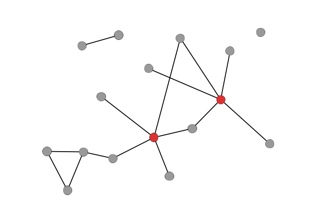
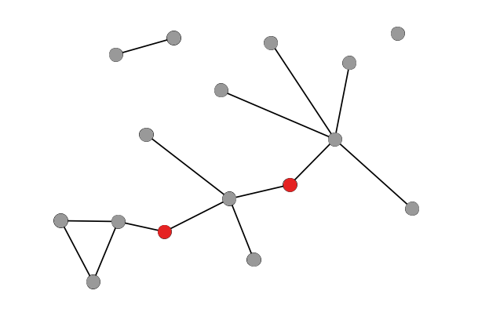
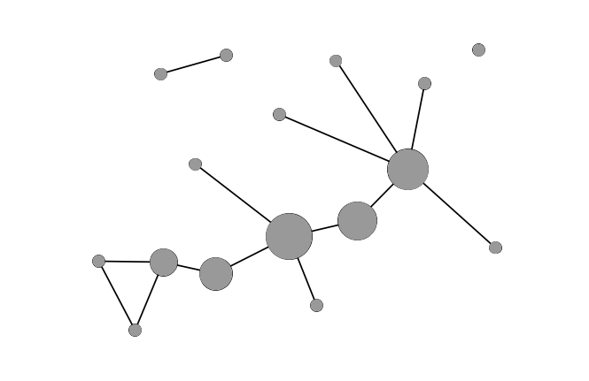
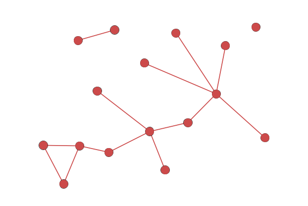
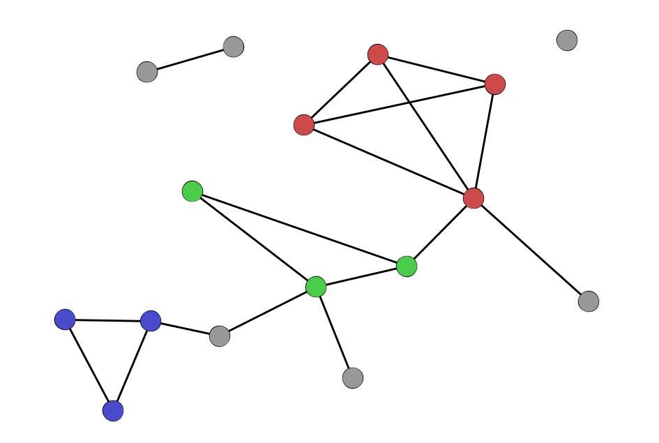
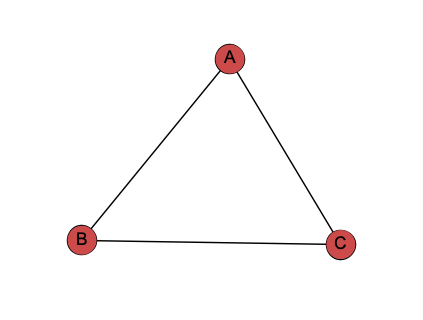
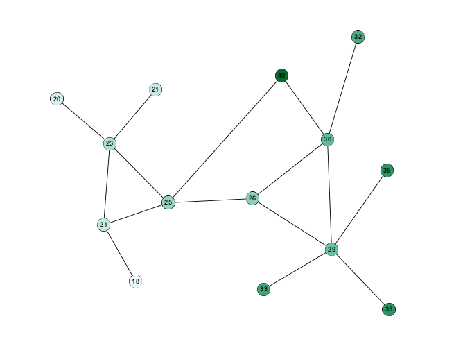

% Understanding and Interpreting Your Network
% John R. Ladd | jrladd.com/slides/networkbasics
% (use arrow keys or spacebar to navigate)

# Basic Parts

## Networks are made up of...

- Entities (entity = node/vertex/actor)
- Relationships (relationship = edge/link/tie)
- We'll use "nodes" and "edges"

## Nodes and Edges have Attributes

## Node Attributes

- numerical (size)
- categorical (color)

## Edge Attributes

## Directed and Undirected Edges

## Weighted and Unweighted Edges

## Edge Types

# Multiple Edges "in a row" Make a Path

## Path & Diameter

(& Average Shortest Path Length)

# Some special kinds of nodes

## Isolates

## Hubs

## Bridges

# Measuring a node's "importance" with centrality

## Degree

## Strength

## Betweenness

# Different kinds of entities or nodes

## Unipartite/unimodal

## Bipartite/bimodal

## Bipartite (cont.)

## Multipartite/k-partite/multimodal

# Groups of nodes within a network

## Connected components

## Cliques and clustering

## Clustering Coefficient

](network_img/clustering_coefficient.svg)

## Communities and community detection

# Density

## A Sparse Network

## A Dense Network

# There are many ways to visualize a network

## Adjacency Matrix

## Adjacency List

- A adjacent to B,C
- B adjacent to A,C
- C adjacent to A,B

## Node-Link Diagram

# Other Important Concepts

## Triadic Closure

## Assortative mixing/Homophily

## Preferential Attachment

## Weak Ties

## Small World Network

- low average path length
- low clustering coefficients
- degree distribution follows power law (a few large hubs)
- low diameter (usually around "six degrees")

