## Understanding the Past with Network Analysis

John R. Ladd | @johnrladd | 30 March 2022

<small>jrladd.com/slides/pastnetworks</small>

<small>(use arrow keys or spacebar to navigate)</small>

## What I'll Talk About:

- Historical network reconstruction in *Six Degrees of Francis Bacon*
- Networks from text documents in *Imaginative Networks*
- Node similarity in *Networks of Biography*

# *Six Degrees of Francis Bacon*

## The SDFB Website

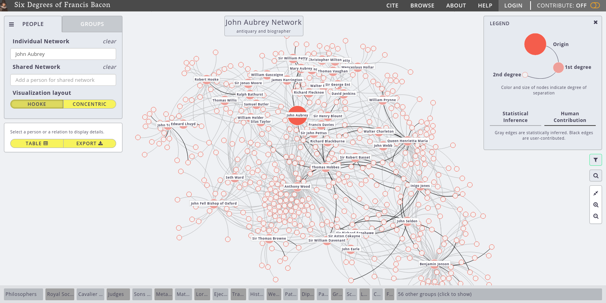

## Inferring a Network

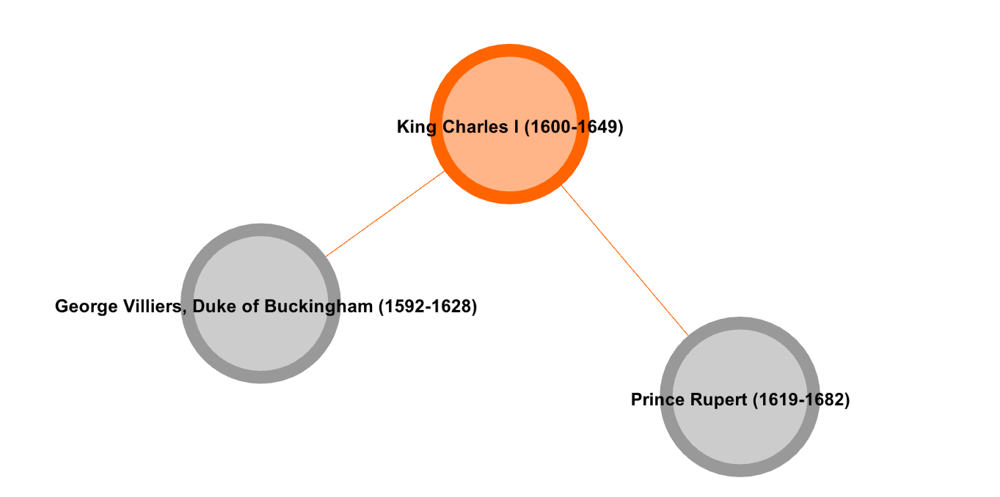{width="50%"}

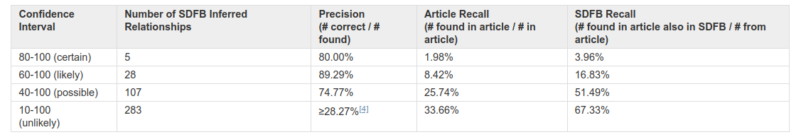

## The full SDFB Network

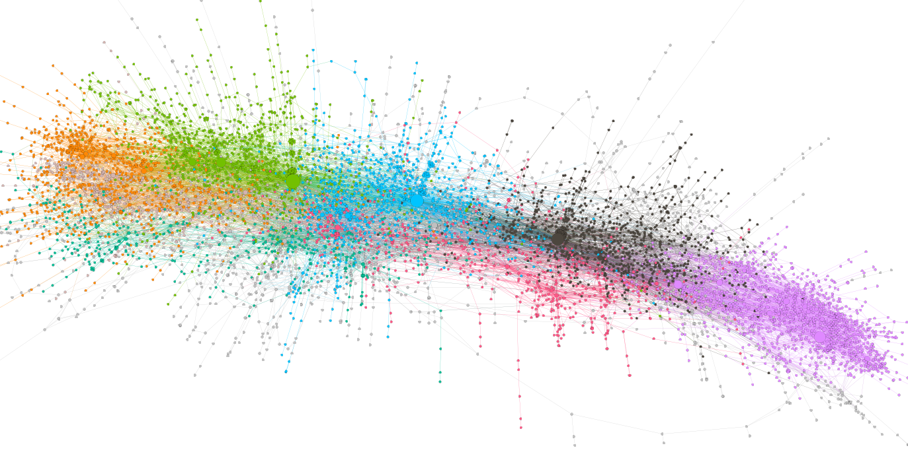

## Crowdsourcing Networks

# *Imaginative Networks*

## Named Entity Recognition

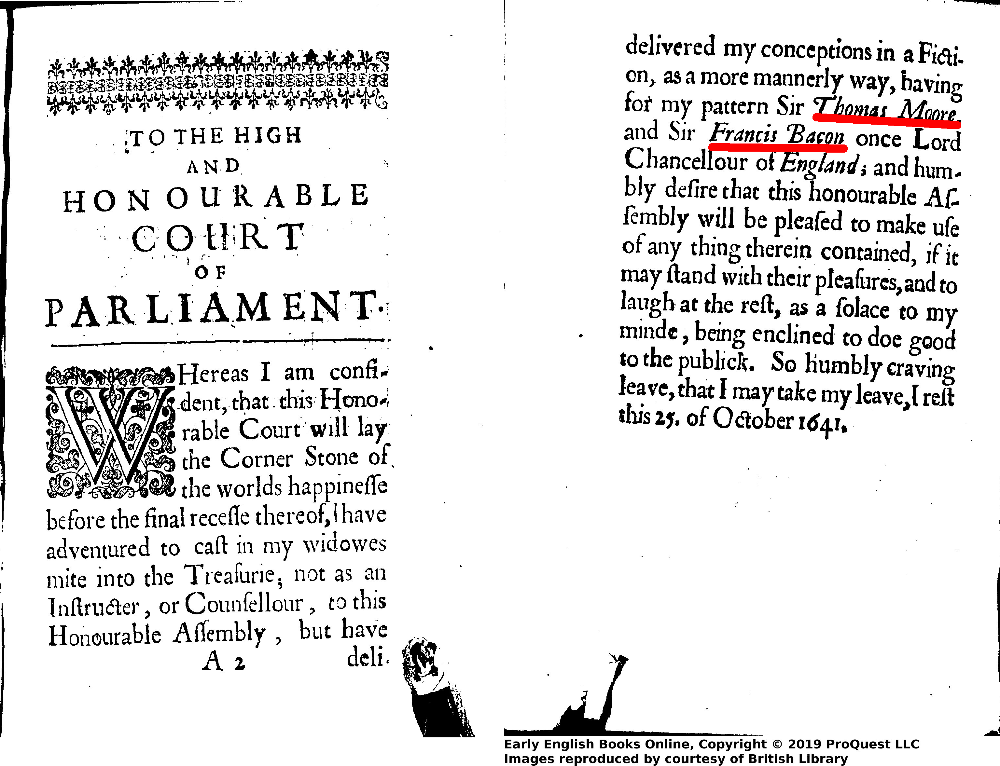

## Creating the Network

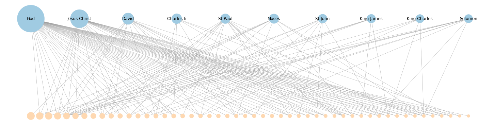

## Measuring the Network

Betweenness centrality of Elizabeth I over time

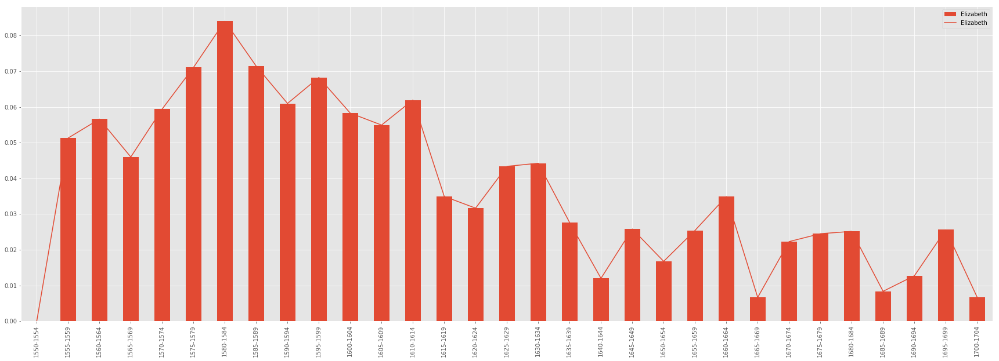

## Measuring the Network

Avg. clustering coefficient (compared to random graphs), 1630-1670

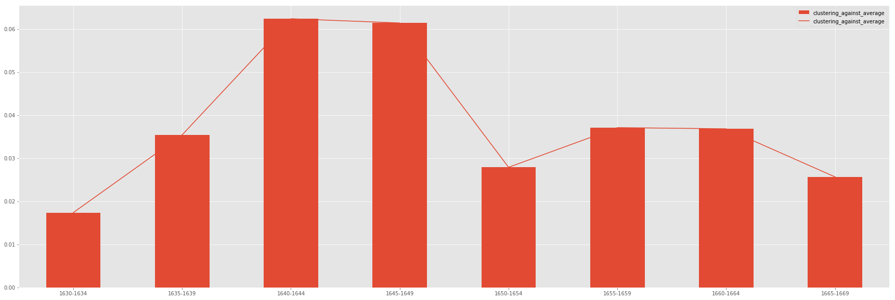

# Comparing Networks of Biography

## John Aubrey's *Brief Lives*

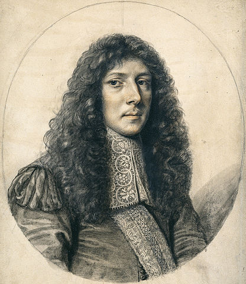

  
"We may be able to hear, through him, the 17th century talking to and about itself."

<small>Kate Bennett, ed. *Brief Lives* (2016)</small>

---

Community Detection

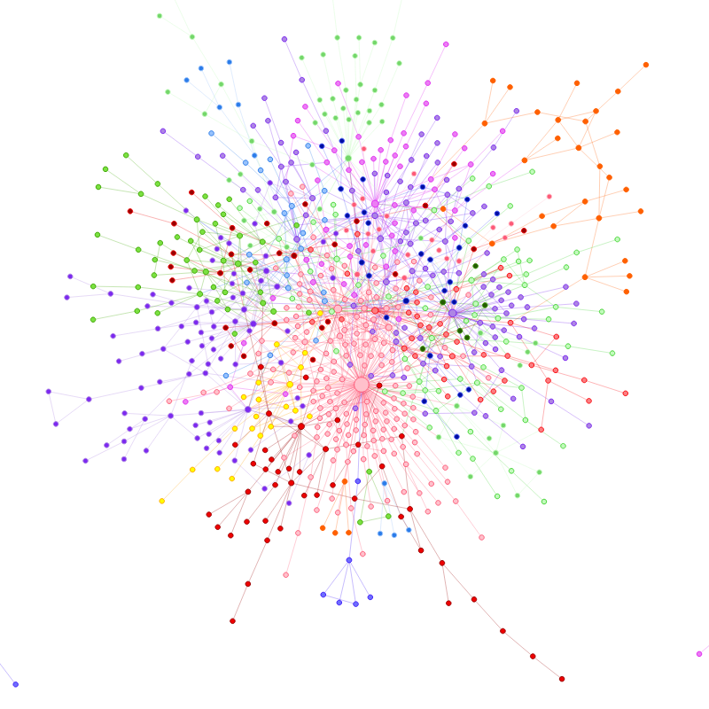

Role Detection

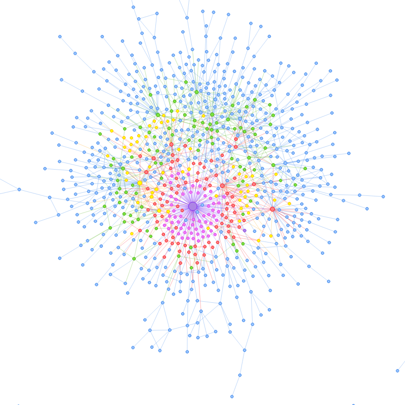

<small>A time-sliced subset of *Six Degrees of Francis Bacon* data.</small>

## Community Detection

## Role Detection

---

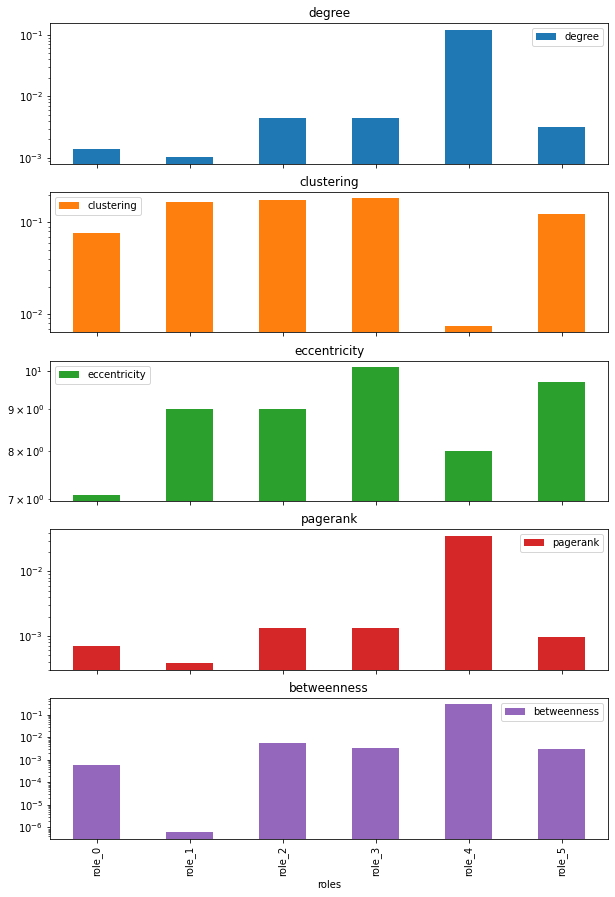{width="40%"}

---

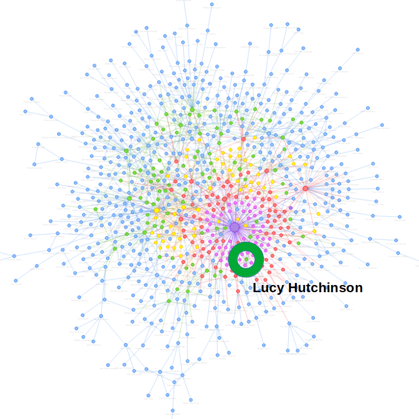

## Who's in Role 3?

- Lucy Hutchinson
- Margaret Cavendish
- Aphra Behn
- John Milton

- John Locke
- Robert Hooke
- Isaac Newton
- Katherine Jones
- and John Aubrey

---

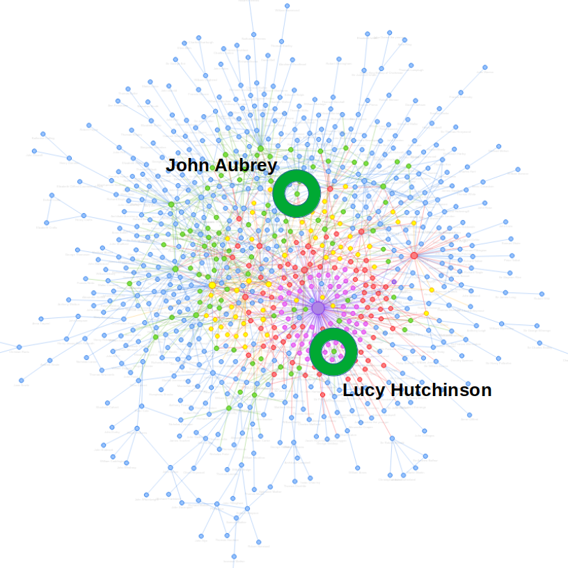

---

:::::::::::::: {.columns}
::: {.column width="50%"}
*Network Navigator*

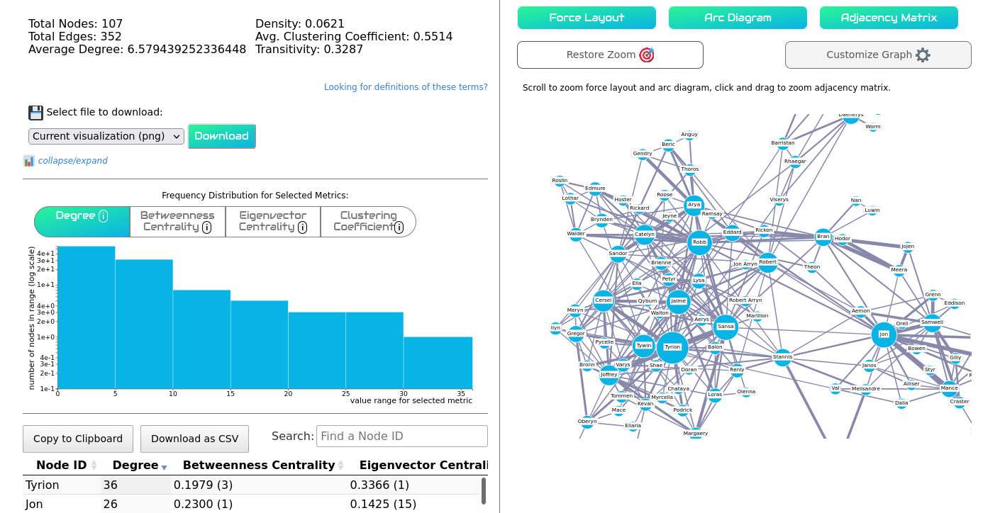
:::
::: {.column width="50%"}
Network Analysis + Digital Art History

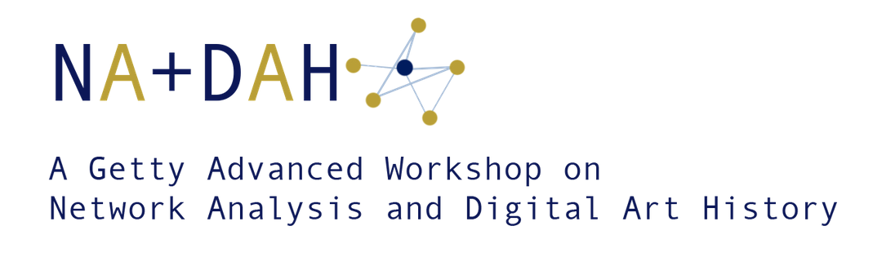
:::
::::::::::::::

# Thank You!
